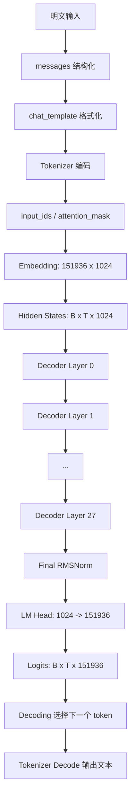
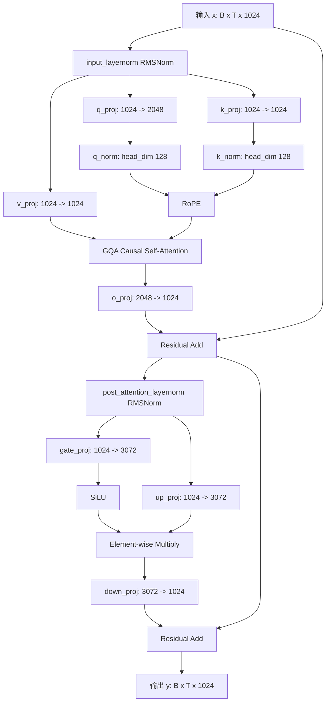

- 数据处理方式和推荐DNN模型类似， 明文->分词->每个词映射到15w词表得到token_id -> 查emb table -> 1024维emb。
- 和推荐不同的是，不会将序列信息进行pooling，而是保留seq_len的长度。 所以输入到模型中的是[batch_size, seq_len, emb_dim]。
- 通过28层decoder网络，还是[batch_size, seq_len, emb_dim]。
- head是一个多分类头，softmax，类别数是15w词表。 所以通过head后得到[batch_size, seq_len, 151936]。 151936中去top1就是贪心搜索，得到top1结果。


---

# Qwen3-0.6B 模型结构详解

本文按 **“整体结构 → 配置参数 → 单层 Decoder 结构 → 输入到输出全过程 → 图示 → 工程使用建议”** 展开，重点说明 Qwen3-0.6B 作为一个 **Decoder-only Causal Language Model** 是如何把明文输入转成 token、经过 28 层 Transformer Decoder 前向计算，并最终生成文本的。

---

## 1. Qwen3-0.6B 的整体定位

**Qwen3-0.6B** 是 Qwen3 系列中的轻量级 Dense 模型，参数规模约为 **0.6B**。它采用类 GPT 的 **Decoder-only Transformer** 架构，用于自回归文本生成：给定前文 token，预测下一个 token。Qwen3 系列 Dense 模型整体上沿用了 GQA、SwiGLU、RoPE、RMSNorm with pre-normalization 等结构设计，并在注意力中引入 QK-Norm，同时去除了 QKV bias，以降低复杂度并提升训练稳定性。[〔1〕](https://blog.csdn.net/Android_XG/article/details/148951433)

从公开的 Qwen3-0.6B 配置看，它包含 **28 层 Decoder Layer**，隐藏维度为 **1024**，注意力头数为 **16**，KV 头数为 **8**，使用 **Grouped Query Attention，GQA**，上下文长度配置为 **40960**，词表大小为 **151936**。[〔2〕](https://blog.csdn.net/qq_41472205/article/details/151083650)

---

# 2. 核心配置参数总览

下面按 Qwen3-0.6B 的 `config.json` 中关键字段进行解释。公开示例中，Qwen3-0.6B 的模型结构打印结果显示为 `Qwen3ForCausalLM`，内部主体为 `Qwen3Model`，包含 `embed_tokens`、28 个 `Qwen3DecoderLayer`、最终 `RMSNorm`、`rotary_emb` 以及 `lm_head`。[〔2〕](https://blog.csdn.net/qq_41472205/article/details/151083650)

| 参数 | 值 | 含义 |
|---|---:|---|
| `model_type` | `qwen3` | 模型类型，告诉 Transformers 使用 Qwen3 架构加载 |
| `architectures` | `Qwen3ForCausalLM` | 用于自回归语言建模的模型类 |
| `vocab_size` | `151936` | 词表大小，即可预测 token 总数 |
| `hidden_size` | `1024` | 每个 token 的隐藏向量维度 |
| `num_hidden_layers` | `28` | Transformer Decoder 层数 |
| `num_attention_heads` | `16` | Query 注意力头数 |
| `num_key_value_heads` | `8` | Key/Value 注意力头数，用于 GQA |
| `head_dim` | `128` | 每个注意力头的维度 |
| `intermediate_size` | `3072` | MLP 中间层维度 |
| `hidden_act` | `silu` | MLP 激活函数，配合 SwiGLU 使用 |
| `rms_norm_eps` | `1e-6` | RMSNorm 数值稳定项 |
| `attention_bias` | `false` | Attention 线性层不使用 bias |
| `attention_dropout` | `0.0` | 注意力 dropout，推理时通常为 0 |
| `max_position_embeddings` | `40960` | 最大位置长度配置 |
| `rope_theta` | `1000000` | RoPE 旋转位置编码的 base |
| `tie_word_embeddings` | `true` | 输入 embedding 与输出 lm_head 权重共享 |
| `torch_dtype` | `bfloat16` | 推荐权重精度 |
| `bos_token_id` | `151643` | 序列开始 token |
| `eos_token_id` | `151645` | 序列结束 token |
| `use_cache` | `true` | 生成时使用 KV Cache 加速 |

其中需要特别注意：`num_attention_heads = 16`，`num_key_value_heads = 8`，说明该模型不是标准 Multi-Head Attention，而是 **GQA**。也就是说，Query 有 16 个头，但 Key/Value 只有 8 个头，每 2 个 Query 头共享一组 Key/Value，从而降低 KV Cache 显存占用。[〔2〕](https://blog.csdn.net/qq_41472205/article/details/151083650)

---

# 3. 顶层模型结构

Qwen3-0.6B 的主体可以抽象为：

```text
Qwen3ForCausalLM
├── Qwen3Model
│   ├── embed_tokens: Embedding(vocab_size=151936, hidden_size=1024)
│   ├── layers: 28 × Qwen3DecoderLayer
│   │   ├── input_layernorm
│   │   ├── self_attn
│   │   │   ├── q_proj
│   │   │   ├── k_proj
│   │   │   ├── v_proj
│   │   │   ├── q_norm
│   │   │   ├── k_norm
│   │   │   └── o_proj
│   │   ├── post_attention_layernorm
│   │   └── mlp
│   │       ├── gate_proj
│   │       ├── up_proj
│   │       ├── SiLU
│   │       └── down_proj
│   ├── norm: final RMSNorm
│   └── rotary_emb: RoPE
└── lm_head: Linear(hidden_size=1024, vocab_size=151936)
```

公开模型结构中，`embed_tokens` 为 `Embedding(151936, 1024)`；每个 Decoder Layer 的 Attention 部分包括 `q_proj: 1024 -> 2048`、`k_proj: 1024 -> 1024`、`v_proj: 1024 -> 1024`、`o_proj: 2048 -> 1024`；MLP 部分包括 `gate_proj: 1024 -> 3072`、`up_proj: 1024 -> 3072`、`down_proj: 3072 -> 1024`。[〔2〕](https://blog.csdn.net/qq_41472205/article/details/151083650)

---

# 4. 每一层 Decoder Layer 的详细结构

Qwen3-0.6B 一共有 **28 层 Decoder Layer**，第 0 层到第 27 层结构相同，只是参数不同。每层可以分成两大块：

1. **Self-Attention Block**
2. **MLP / Feed Forward Block**

它采用 **Pre-Norm** 结构，即在 Attention 和 MLP 之前先做 RMSNorm。Qwen3 Dense 模型使用 RMSNorm with pre-normalization，并结合 RoPE、GQA、SwiGLU 等结构。[〔1〕](https://blog.csdn.net/Android_XG/article/details/148951433)

---

## 4.1 输入输出形状

假设：

```text
B = batch size
T = sequence length
H = hidden_size = 1024
```

则进入每一层 Decoder Layer 的张量形状为：

```text
hidden_states: [B, T, 1024]
```

经过该层后，输出形状仍然是：

```text
hidden_states: [B, T, 1024]
```

Transformer 层内部虽然会升维到 2048 或 3072，但每层的输入输出主干维度始终保持 **1024**，便于层与层之间堆叠。

---

## 4.2 Attention Block 结构

单层 Attention 结构如下：

```text
x
├── RMSNorm
├── q_proj: 1024 -> 2048
├── k_proj: 1024 -> 1024
├── v_proj: 1024 -> 1024
├── q_norm / k_norm
├── RoPE
├── GQA Attention
├── o_proj: 2048 -> 1024
└── Residual Add
```

对应张量变化：

| 步骤 | 张量形状 | 说明 |
|---|---|---|
| 输入 | `[B, T, 1024]` | 当前层输入 |
| `input_layernorm` | `[B, T, 1024]` | RMSNorm |
| `q_proj` | `[B, T, 2048]` | 16 个 Q heads × 128 |
| `k_proj` | `[B, T, 1024]` | 8 个 K heads × 128 |
| `v_proj` | `[B, T, 1024]` | 8 个 V heads × 128 |
| reshape Q | `[B, T, 16, 128]` | Query 多头 |
| reshape K | `[B, T, 8, 128]` | Key 多头 |
| reshape V | `[B, T, 8, 128]` | Value 多头 |
| GQA | `[B, T, 16, 128]` | KV 头被 Query 头分组共享 |
| concat | `[B, T, 2048]` | 16 × 128 |
| `o_proj` | `[B, T, 1024]` | 投回 hidden_size |
| residual | `[B, T, 1024]` | 与原输入相加 |

注意这里有一个容易误解的点：虽然 `hidden_size = 1024`，但 `q_proj` 输出是 **2048**。这是因为 Qwen3-0.6B 配置中 `num_attention_heads = 16`，`head_dim = 128`，所以 Query 总维度为：

```text
16 × 128 = 2048
```

而 Key/Value 使用 `num_key_value_heads = 8`：

```text
8 × 128 = 1024
```

因此 Q、K、V 的输出维度并不相同，这是 GQA 结构的直接体现。[〔2〕](https://blog.csdn.net/qq_41472205/article/details/151083650)

---

## 4.3 QK-Norm 的作用

Qwen3 Attention 中包含：

```text
q_norm: RMSNorm((128,), eps=1e-6)
k_norm: RMSNorm((128,), eps=1e-6)
```

它们不是对整个 hidden size 做归一化，而是对每个 attention head 的 `head_dim = 128` 做归一化。其作用是对 Query 和 Key 的尺度进行控制，提升注意力分数计算的稳定性。Qwen3 技术解析中也提到，Qwen3 在注意力机制中引入 QK-Norm 来确保稳定训练。[〔1〕](https://blog.csdn.net/Android_XG/article/details/148951433)

---

## 4.4 RoPE 旋转位置编码

Qwen3-0.6B 使用 `Qwen3RotaryEmbedding`，配置中 `rope_theta = 1000000`，`max_position_embeddings = 40960`。RoPE 的作用是把位置信息注入 Query 和 Key，使注意力计算能够感知 token 的相对位置。公开资料中，Qwen3 结构包含 `rotary_emb`，用于为模型提供序列中 token 的位置信息。[〔2〕](https://blog.csdn.net/qq_41472205/article/details/151083650)[〔4〕](https://www.cnblogs.com/horizondeveloper/p/19444777)

简化理解：

```text
原始 Q, K
  ↓
根据 position_id 计算旋转角度
  ↓
对 Q, K 的部分维度做旋转变换
  ↓
带位置信息的 Q, K
```

RoPE 不像传统位置编码那样直接加到 embedding 上，而是在 Attention 内部作用于 Q/K。

---

## 4.5 Causal Mask 的作用

Qwen3-0.6B 是自回归语言模型，因此在训练和生成时都需要 **因果掩码 Causal Mask**：

```text
第 t 个 token 只能看见 0 ~ t 的历史 token
不能看见 t 之后的未来 token
```

例如输入：

```text
我 爱 京 东
```

预测“京”时，模型只能看到：

```text
我 爱
```

不能提前看到后面的“东”。

这保证了训练目标与推理生成方式一致，即：

```text
P(x1, x2, ..., xn) = Π P(xt | x< t)
```

---

## 4.6 MLP Block 结构

Attention 后进入 MLP：

```text
x
├── RMSNorm
├── gate_proj: 1024 -> 3072
├── up_proj: 1024 -> 3072
├── SiLU(gate_proj(x)) * up_proj(x)
├── down_proj: 3072 -> 1024
└── Residual Add
```

对应公式可以写成：

```text
MLP(x) = down_proj( SiLU(gate_proj(x)) ⊙ up_proj(x) )
```

其中：

- `⊙` 表示逐元素乘法；
- `SiLU` 是激活函数；
- `gate_proj` 和 `up_proj` 共同构成 SwiGLU 风格结构；
- `down_proj` 把中间维度从 3072 投回 1024。

公开结构中，Qwen3-0.6B 的每层 MLP 确实包含 `gate_proj`、`up_proj`、`down_proj`，激活函数为 `SiLU()`。[〔2〕](https://blog.csdn.net/qq_41472205/article/details/151083650)

---

# 5. 单层 Decoder Layer 的计算公式

假设当前层输入为 `x`，则一层 Qwen3 Decoder Layer 可以简化为：

```text
a = RMSNorm(x)
attn_out = SelfAttention(a)
x = x + attn_out

m = RMSNorm(x)
mlp_out = MLP(m)
x = x + mlp_out
```

更细化：

```text
Q = q_proj(RMSNorm(x))
K = k_proj(RMSNorm(x))
V = v_proj(RMSNorm(x))

Q = q_norm(Q)
K = k_norm(K)

Q, K = apply_rope(Q, K, position_ids)

Attention(Q, K, V) = softmax((QK^T + causal_mask) / sqrt(head_dim)) V

attn_out = o_proj(Attention(Q, K, V))

x = x + attn_out

mlp_out = down_proj(SiLU(gate_proj(RMSNorm(x))) * up_proj(RMSNorm(x)))

x = x + mlp_out
```

该结构重复 **28 次**。

---

# 6. 参数量粗略拆解

基于公开结构，可以粗略估算 Qwen3-0.6B 的主要参数量。这里仅按矩阵规模估算，不考虑极少量额外元信息。

## 6.1 Embedding 参数

```text
vocab_size × hidden_size
= 151936 × 1024
= 155,582,464
```

由于 `tie_word_embeddings = true`，输入 embedding 和输出 `lm_head` 权重共享，因此输出层通常不额外增加一份同规模参数。[〔2〕](https://blog.csdn.net/qq_41472205/article/details/151083650)

---

## 6.2 每层 Attention 参数

```text
q_proj: 1024 × 2048 = 2,097,152
k_proj: 1024 × 1024 = 1,048,576
v_proj: 1024 × 1024 = 1,048,576
o_proj: 2048 × 1024 = 2,097,152
```

合计：

```text
6,291,456
```

由于 `attention_bias = false`，这些线性层没有 bias 参数。[〔2〕](https://blog.csdn.net/qq_41472205/article/details/151083650)

---

## 6.3 每层 MLP 参数

```text
gate_proj: 1024 × 3072 = 3,145,728
up_proj:   1024 × 3072 = 3,145,728
down_proj: 3072 × 1024 = 3,145,728
```

合计：

```text
9,437,184
```

---

## 6.4 每层归一化参数

每层包含：

```text
input_layernorm: 1024
post_attention_layernorm: 1024
q_norm: 128
k_norm: 128
```

合计：

```text
2,304
```

---

## 6.5 单层总参数

```text
Attention 参数: 6,291,456
MLP 参数:       9,437,184
Norm 参数:          2,304
--------------------------------
单层合计:      15,730,944
```

28 层：

```text
15,730,944 × 28 = 440,466,432
```

加上 embedding 和 final norm 后，总量约：

```text
440,466,432 + 155,582,464 + 1,024 ≈ 596,049,920
```

即约 **0.596B 参数**，与 Qwen3-0.6B 的命名一致。

---

# 7. 从输入明文到输出文本的完整流程

下面用一个简单输入示例说明全过程。

## 7.1 输入明文

假设用户输入：

```text
请用一句话介绍互联网公司。
```

如果使用聊天模型接口，通常会先组织成 messages：

```python
messages = [
    {"role": "user", "content": "请用一句话介绍互联网公司。"}
]
```

在 Qwen3-0.6B 的示例中，可以通过 tokenizer 的 `apply_chat_template` 把 messages 转成模型需要的文本格式，并可以通过 `enable_thinking=True` 控制是否启用 thinking 模式。公开示例中使用了 `tokenizer.apply_chat_template(..., enable_thinking=True)`，然后再送入模型生成。[〔2〕](https://blog.csdn.net/qq_41472205/article/details/151083650)

---

## 7.2 Chat Template 预处理

概念上，结构化 messages 会被转换成类似下面的 prompt：

```text
<|im_start|>user
请用一句话介绍互联网公司。<|im_end|>
<|im_start|>assistant
```

实际格式应以 tokenizer 内置 `chat_template` 为准，不建议手写。推荐使用：

```python
text = tokenizer.apply_chat_template(
    messages,
    tokenize=False,
    add_generation_prompt=True,
    enable_thinking=False
)
```

其中：

| 参数 | 作用 |
|---|---|
| `messages` | 多轮对话消息 |
| `tokenize=False` | 先输出字符串，而不是直接 token ids |
| `add_generation_prompt=True` | 在末尾添加 assistant 开始标记，引导模型生成 |
| `enable_thinking` | 控制是否启用 Qwen3 的思考模式 |

Qwen3 后训练阶段支持思考模式和非思考模式的融合，允许用户或开发者在不同任务中选择是否让模型进行更复杂推理。[〔1〕](https://blog.csdn.net/Android_XG/article/details/148951433)

---

## 7.3 Tokenizer 编码

然后 tokenizer 会把字符串转成 token ids：

```python
model_inputs = tokenizer([text], return_tensors="pt")
```

输出通常包括：

```python
{
    "input_ids": tensor([[151643, ..., 151645, ...]]),
    "attention_mask": tensor([[1, 1, 1, 1, ...]])
}
```

其中：

- `input_ids`：每个 token 对应的整数 ID；
- `attention_mask`：标记哪些位置是真实 token，哪些是 padding；
- `bos_token_id = 151643`；
- `eos_token_id = 151645`。[〔2〕](https://blog.csdn.net/qq_41472205/article/details/151083650)

注意：具体 token id 序列必须以实际 tokenizer 运行为准，不应手工猜测。

---

## 7.4 Embedding 层

输入：

```text
input_ids: [B, T]
```

经过 embedding：

```text
inputs_embeds = embed_tokens(input_ids)
```

形状变为：

```text
[B, T] -> [B, T, 1024]
```

也就是说，每个 token id 被映射成一个 1024 维向量。

---

## 7.5 位置编码与 Decoder 前向

模型会根据 `position_ids` 和 RoPE 给 Q/K 注入位置信息，然后依次通过 28 层 Decoder Layer：

```text
hidden_states
  ↓
Layer 0
  ↓
Layer 1
  ↓
...
  ↓
Layer 27
```

每一层内部执行：

```text
RMSNorm → Self-Attention → Residual
RMSNorm → MLP → Residual
```

输出形状始终保持：

```text
[B, T, 1024]
```

---

## 7.6 Final Norm 与 LM Head

28 层之后：

```text
hidden_states = final_norm(hidden_states)
logits = lm_head(hidden_states)
```

形状变化：

```text
[B, T, 1024] -> [B, T, 151936]
```

其中 `logits[b, t, :]` 表示第 `b` 个样本、第 `t` 个位置上，对整个词表中每个 token 的预测分数。

---

## 7.7 生成下一个 token

对于自回归生成，模型通常只取最后一个位置的 logits：

```text
next_token_logits = logits[:, -1, :]
```

然后通过 decoding 策略选择下一个 token：

| 策略 | 说明 |
|---|---|
| Greedy Search | 选择概率最高的 token |
| Top-k Sampling | 只从概率最高的 k 个 token 中采样 |
| Top-p Sampling | 从累计概率达到 p 的 token 集合中采样 |
| Temperature | 调整分布平滑程度 |
| Beam Search | 保留多个候选路径，适合确定性任务 |

选出下一个 token 后，把它拼接回输入序列，继续预测下一个 token，直到遇到 `eos_token_id` 或达到 `max_new_tokens`。

---

# 8. 整体流程图

## 8.1 ASCII 图示

```text
明文输入
  │
  ▼
messages 结构化
  │
  ▼
chat_template 格式化
  │
  ▼
Tokenizer 编码
  │
  ├── input_ids:      [B, T]
  └── attention_mask: [B, T]
  │
  ▼
Embedding
  │
  ▼
hidden_states: [B, T, 1024]
  │
  ▼
┌────────────────────────────────────┐
│        28 × Qwen3DecoderLayer       │
│                                    │
│  ┌──────────────────────────────┐  │
│  │ input_layernorm: RMSNorm      │  │
│  │ q/k/v projection              │  │
│  │ q_norm / k_norm               │  │
│  │ RoPE                          │  │
│  │ GQA causal self-attention     │  │
│  │ o_proj                        │  │
│  │ residual add                  │  │
│  └──────────────────────────────┘  │
│                                    │
│  ┌──────────────────────────────┐  │
│  │ post_attention_layernorm      │  │
│  │ gate_proj / up_proj           │  │
│  │ SiLU + multiply               │  │
│  │ down_proj                     │  │
│  │ residual add                  │  │
│  └──────────────────────────────┘  │
└────────────────────────────────────┘
  │
  ▼
Final RMSNorm
  │
  ▼
LM Head
  │
  ▼
logits: [B, T, 151936]
  │
  ▼
Decoding
  │
  ▼
输出 token
  │
  ▼
Tokenizer decode
  │
  ▼
自然语言输出
```

---

## 8.2 Mermaid 图示



---

# 9. 单个 Decoder Layer 图示



---

# 10. 示例代码：从输入到生成

下面是一个典型 Hugging Face 推理流程。示例结构与公开 Qwen3-0.6B 加载方式一致：使用 `AutoTokenizer` 和 `AutoModelForCausalLM`，并通过 `apply_chat_template` 构造输入。[〔2〕](https://blog.csdn.net/qq_41472205/article/details/151083650)

```python
import torch
from transformers import AutoTokenizer, AutoModelForCausalLM

model_name = "Qwen/Qwen3-0.6B"

tokenizer = AutoTokenizer.from_pretrained(model_name)

model = AutoModelForCausalLM.from_pretrained(
    model_name,
    torch_dtype="auto",
    device_map="auto"
)

messages = [
    {"role": "user", "content": "请用一句话介绍互联网公司。"}
]

text = tokenizer.apply_chat_template(
    messages,
    tokenize=False,
    add_generation_prompt=True,
    enable_thinking=False
)

model_inputs = tokenizer(
    [text],
    return_tensors="pt"
).to(model.device)

with torch.no_grad():
    generated_ids = model.generate(
        **model_inputs,
        max_new_tokens=128,
        do_sample=False
    )

output_ids = generated_ids[0][len(model_inputs.input_ids[0]):]
response = tokenizer.decode(output_ids, skip_special_tokens=True)

print(response)
```

可能输出类似：

```text
互联网公司是一家以供应链为基础的技术与服务企业，业务覆盖零售、物流、科技等多个领域。
```

以上输出只是示例，实际结果会受模型版本、生成参数、prompt、是否启用 thinking 等因素影响。

---

# 11. Forward 过程的伪代码

下面是更贴近模型内部的简化伪代码：

```python
def forward(input_ids, attention_mask=None, past_key_values=None):
    # 1. token embedding
    hidden_states = embed_tokens(input_ids)  # [B, T, 1024]

    # 2. position ids / cache position
    position_ids = build_position_ids(input_ids, past_key_values)

    # 3. causal mask
    causal_mask = build_causal_mask(attention_mask, position_ids)

    # 4. 28 decoder layers
    for layer in layers:
        residual = hidden_states

        # attention block
        x = layer.input_layernorm(hidden_states)

        q = layer.self_attn.q_proj(x)  # [B, T, 2048]
        k = layer.self_attn.k_proj(x)  # [B, T, 1024]
        v = layer.self_attn.v_proj(x)  # [B, T, 1024]

        q = reshape(q, [B, T, 16, 128])
        k = reshape(k, [B, T, 8, 128])
        v = reshape(v, [B, T, 8, 128])

        q = layer.self_attn.q_norm(q)
        k = layer.self_attn.k_norm(k)

        q, k = apply_rope(q, k, position_ids)

        attn_output = grouped_query_attention(
            q, k, v,
            causal_mask=causal_mask,
            past_key_values=past_key_values
        )

        attn_output = reshape(attn_output, [B, T, 2048])
        attn_output = layer.self_attn.o_proj(attn_output)  # [B, T, 1024]

        hidden_states = residual + attn_output

        # mlp block
        residual = hidden_states
        x = layer.post_attention_layernorm(hidden_states)

        gate = layer.mlp.gate_proj(x)  # [B, T, 3072]
        up = layer.mlp.up_proj(x)      # [B, T, 3072]

        mlp_output = silu(gate) * up
        mlp_output = layer.mlp.down_proj(mlp_output)  # [B, T, 1024]

        hidden_states = residual + mlp_output

    # 5. final norm
    hidden_states = norm(hidden_states)

    # 6. lm head
    logits = lm_head(hidden_states)  # [B, T, 151936]

    return logits
```

---

# 12. 训练和推理时的差异

## 12.1 训练阶段

训练时通常输入完整序列：

```text
x0, x1, x2, ..., xn
```

目标是让模型在每个位置预测下一个 token：

```text
输入: x0, x1, x2, ..., x(n-1)
目标: x1, x2, x3, ..., xn
```

损失函数通常是交叉熵：

```text
Loss = CrossEntropy(logits, labels)
```

---

## 12.2 推理阶段

推理时是逐 token 生成：

```text
输入 prompt
  ↓
预测 token_1
  ↓
把 token_1 拼回输入
  ↓
预测 token_2
  ↓
...
```

为避免每一步都重复计算历史 token，模型会使用 **KV Cache**。配置中 `use_cache = true`，表示生成时可以缓存历史 Key/Value，提升推理速度。[〔2〕](https://blog.csdn.net/qq_41472205/article/details/151083650)

KV Cache 的核心思想：

```text
第 1 步：计算 prompt 的 K/V，缓存起来
第 2 步：新 token 只计算自己的 Q/K/V，复用历史 K/V
第 3 步：继续追加缓存
```

这对长文本生成非常重要。

---

# 13. Qwen3-0.6B 结构特点总结

| 特点 | 说明 | 价值 |
|---|---|---|
| Decoder-only | 类 GPT 自回归架构 | 适合文本生成、对话、补全 |
| 28 层 Decoder | 深度适中 | 在轻量模型中保持一定表达能力 |
| hidden size 1024 | 主干维度 | 控制模型容量与推理成本 |
| GQA | 16 Q heads，8 KV heads | 降低 KV Cache 成本 |
| head_dim 128 | 每头维度较大 | 有利于注意力表达 |
| QK-Norm | 对 Q/K 做 head 维度归一化 | 提升训练稳定性 |
| RoPE | 旋转位置编码 | 支持长上下文建模 |
| SwiGLU MLP | gate/up/down 三投影 | 提升非线性表达能力 |
| RMSNorm Pre-Norm | Attention/MLP 前归一化 | 稳定深层训练 |
| tied embedding | 输入输出权重共享 | 降低参数量 |
| bfloat16 | 推荐推理/训练精度 | 节省显存并保持稳定性 |

---

# 14. 一个直观类比

可以把 Qwen3-0.6B 看成一个 **28 级语言理解与生成流水线**：

```text
Tokenizer：
把文字拆成模型认识的 token 编号。

Embedding：
把 token 编号变成 1024 维语义向量。

每层 Attention：
让每个 token 回看它之前的上下文，决定哪些历史信息重要。

每层 MLP：
对每个 token 的语义表示做更复杂的非线性变换。

Final Norm：
整理最终表示，使数值分布更稳定。

LM Head：
把 1024 维向量映射到 151936 个词表 token 的概率分布。

Decoding：
从概率分布中选出下一个 token。

Tokenizer Decode：
把 token 还原成人类可读文本。
```

---

## 关键结论

1. **Qwen3-0.6B 是 28 层 Decoder-only Causal LM**，主干隐藏维度为 **1024**。  
2. 每层包含 **RMSNorm → GQA Self-Attention → Residual → RMSNorm → SwiGLU MLP → Residual**。  
3. Attention 中 **Q 为 16 头，K/V 为 8 头**，体现了 GQA 设计。  
4. MLP 使用 `gate_proj / up_proj / down_proj` 结构，中间维度为 **3072**。  
5. 输入明文会经过 **chat_template → tokenizer → embedding → 28 层 decoder → lm_head → decoding → 文本输出**。  
6. 由于 `tie_word_embeddings = true`，Qwen3-0.6B 总参数量约 **0.596B**，与模型命名基本一致。
